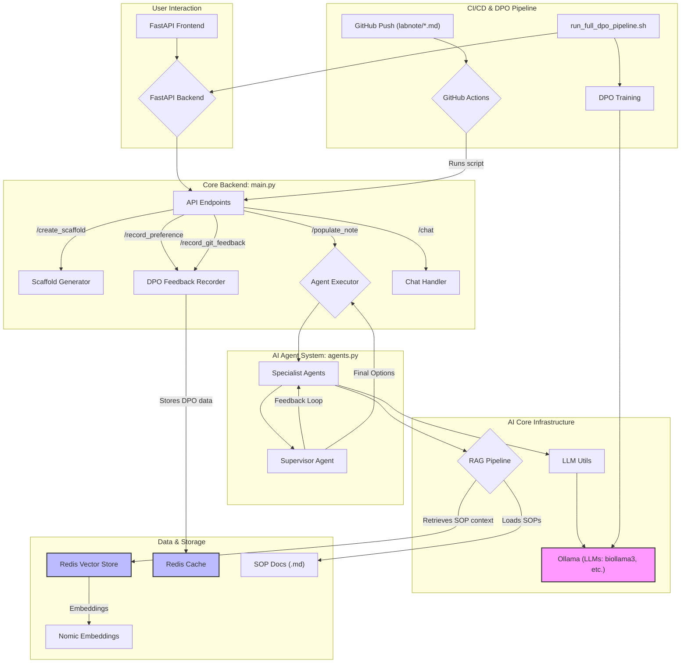

# DPO

`labnote-ai-backend` 프로젝트의 DPO(Direct Preference Optimization, 직접 선호 최적화)는 두 가지 주요 경로를 통해 이루어집니다: **1) VS Code 확장 프로그램을 통한 사용자의 직접적인 피드백**과 **2) GitHub 커밋을 통한 자동화된 피드백**입니다. 이 과정을 통해 AI 모델이 사용자의 선호를 학습하고 점진적으로 개선됩니다.

## DPO 작동 방식 요약 다이어그램

아래 다이어그램은 전체 시스템 아키텍처 내에서 DPO 피드백 루프가 어떻게 작동하는지 보여줍니다.

-----

## DPO 데이터 수집 및 학습 과정

### 1단계: AI 제안 생성 (다중 에이전트 시스템)

1.  **사용자 요청**: 사용자가 VS Code 확장 프로그램에서 'AI 섹션 내용 채우기' 기능을 실행하면 `/populate_note` API가 호출됩니다.
2.  **초안 생성 (Specialist Agents)**: 백엔드의 `agents.py`의 `_generate_drafts` 함수가 호출됩니다. `biollama3`, `mixtral`, `llama3:70b`와 같은 여러 LLM(Specialist Agents)이 동시에 호출되어 섹션 내용에 대한 다양한 초안을 생성합니다.
3.  **초안 평가 (Supervisor Agent)**: `supervisor_agent` 함수가 생성된 초안들을 평가합니다. 점수가 기준(8.5점)을 넘지 못하면, 구체적인 피드백과 함께 Specialist Agent에게 재작성을 요청하는 내부 루프가 실행됩니다.
4.  **옵션 제공**: 품질 기준을 통과한 고품질의 초안들이 사용자에게 여러 옵션으로 제공됩니다.

### 2단계: DPO 데이터 수집

#### 경로 A: VS Code를 통한 직접 피드백

1.  **사용자 선택 및 수정**: 사용자는 AI가 제안한 여러 옵션 중 하나를 선택하고, 필요에 따라 내용을 직접 수정합니다.
2.  **데이터 전송**: '적용 및 AI 학습' 버튼을 누르면, `record_preference` API로 다음 정보가 전송됩니다:
      * `chosen_original`: 사용자가 선택한 AI의 원본 제안
      * `chosen_edited`: 사용자가 최종 수정한 내용
      * `rejected`: 사용자가 선택하지 않은 나머지 AI 제안들
      * 관련 메타데이터 (실험 목표, 파일 경로, UO ID 등)
3.  **Redis 저장**: 백엔드는 이 데이터를 DPO 학습 형식(`prompt`, `chosen`, `rejected`)으로 가공하여 Redis에 저장합니다.

#### 경로 B: GitHub 커밋을 통한 자동화된 피드백

1.  **GitHub Push**: 사용자가 `labnote` 디렉토리 내의 마크다운 파일을 수정한 후 GitHub에 Push하면, `.github/workflows/dpo_feedback.yml`에 정의된 GitHub Actions가 자동으로 실행됩니다.
2.  **변경 내용 분석**: `scripts/generate_dpo_from_git.py` 스크립트가 실행되어 `git diff`를 통해 파일의 이전 버전과 현재 버전을 비교합니다.
3.  **DPO 데이터 생성**: 변경된 섹션 내용에 대해 다음 데이터가 생성됩니다:
      * `chosen`: 현재(수정 후) 내용
      * `rejected`: 이전 내용
4.  **데이터 전송 및 저장**: 생성된 데이터는 `/record_git_feedback` API를 통해 백엔드로 전송되어 Redis에 저장됩니다.

### 3단계: DPO 모델 학습 및 배포

1.  **학습 파이프라인 실행**: `run_full_dpo_pipeline.sh` 스크립트를 실행하여 전체 DPO 과정을 시작합니다.
2.  **모델 학습**: `scripts/run_dpo_training.py` 스크립트가 Redis에 축적된 `chosen`과 `rejected` 쌍을 학습 데이터로 사용하여 기존 `Llama3-OpenBioLLM-8B` 모델을 DPO 방식으로 미세 조정(fine-tuning)합니다.
3.  **모델 변환 및 배포**: 학습이 완료되면 `scripts/deploy_model.sh` 스크립트가 다음을 수행합니다:
      * 학습된 모델을 GGUF 형식으로 변환하고 양자화합니다.
      * Ollama에 새로운 버전의 모델(예: `biollama3:dpo-v2`)을 등록합니다.
      * `.env` 파일의 `LLM_MODEL` 변수를 새로 배포된 모델 이름으로 자동 업데이트하여, 이후의 모든 AI 요청이 개선된 모델을 사용하도록 합니다.
4.  **서버 재시작**: 마지막으로 스크립트는 새로운 모델을 적용하기 위해 FastAPI 서버를 재시작합니다.

이러한 순환적인 과정을 통해 `labnote-ai-backend` 시스템은 사용자의 실제 사용 패턴과 선호를 지속적으로 학습하여, 시간이 지남에 따라 더욱 정확하고 유용한 연구 노트를 생성하게 됩니다.
